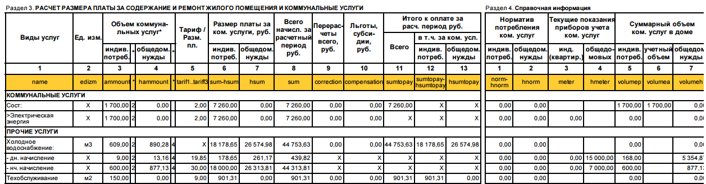

[TOC]

Выгрузка данных производится программно по протоколу обмена данными, либо на странице *Сервисы — ТСЖ — Обмен — Импорт* в [административной части](http://dev.1c-bitrix.ru/learning/course/index.php?COURSE_ID=35&LESSON_ID=2833#admin) сайта.

Формат предназначен для передачи на сайт сведений о лицевых счетах и всего, что с ними связано. Файл обмена должен содержать сведения за определенный период, дата которого указана в атрибуте `ORG`.

**Параметры запроса на обработку данных**:

|             | Возможные значения    |  Описание |
| ----------- | --------------------- | -------- |
| **mode**    | `import`              |  |
| **type**    | `accounts`            |  |
| **inn**     | Целое число           | На сайте должен существовать *Объект управления* с указанным ИНН |
| **filename**| Строка                | Необходимо указать имя загруженного в текущей сессии файла. [Подробнее о загрузке файлов](/Для_разработчиков/Протокол_обмена#Загрузка-данных_Общие-требования-к-xml-файлам_Передача-файлов) |

> Обязательные атрибуты отмечены **полужирным**.  

# Пример

* Скачать [образец квитанции](files/example-pdf.pdf), полученной после загрузки примера

```xml
<?xml version="1.0" encoding="UTF-8"?>
<ORG filedate="01.01.2015" name="ТСЖ &quot;Престиж&quot;" inn="7721122600" filetype="calculations" version="3" bank="ОАО &quot;БАНК МОСКВЫ&quot;" rs="40704820100320030032" ks="30201810500000300214" bik="044525219">
	<!-- Сведения о поставщиках -->
	<contractors>
		<contractor id="000000067" name="ООО Лендор" inn="" kpp="" services="Сост" rs="" bank="" ks="&quot;" bik="&quot;">к/с ", БИК "</contractor>
		<contractor id="000000071" name="ООО &quot;Стройиндустрия&quot;" inn="" kpp="" services="Электрическая энергия" rs="" bank="" ks="&quot;" bik="&quot;">к/с ", БИК "</contractor>
		<contractor id="000000002" name="ТСЖ &quot;Престиж&quot;" inn="7721122600" kpp="" executor="1" address="113205, Москва г, Вавилова, дом № 65" phone="936-16-36, факс: 936-16-36" rs="40704820100320030032" bank="ОАО &quot;БАНК МОСКВЫ&quot; " ks="30201810500000300214" bik="044525219">р/с 40704820100320030032, в ОАО "БАНК МОСКВЫ" , г. Москва, к/с 30201810500000300214, БИК 044525219</contractor>
	</contractors>

	<!-- Общедомовые приборы учета -->
	<hmeters>
		<hmeter value_count="1" kod="000000185" name="СчетчикТестОПУ" num="" service="ТестУслугаОПУ" indiccur1="1 000"/>
		<hmeter value_count="1" kod="000000124" name="345816" num="345816" service="Газовое снабжение" indiccur1="0"/>
		<hmeter value_count="2" kod="000000182" name="ОбщедомовойОтопление" num="" service="Горячее водоснабжение" indiccur1="100" indiccur2="50"/>
		<hmeter value_count="1" kod="000000087" name="112336 03" num="112336 03" service="Холодное водоснабжение" indiccur1="0"/>
		<hmeter value_count="2" kod="000000183" name="ХолодноеВодоснабжение" num="Заводской номер тест №1" service="Холодное водоснабжение" indiccur1="15 000" indiccur2="7 000"/>
	</hmeters>

	<!-- Данные, относящиеся к определенному лицевому счету -->
	<PersAcc AddressCity="" AddressDistrict="" AddressFlat="1" FlatAbbr="Кв. 1" AddressHouse="67" AddressRegion="Москва г" AddressSettlement="" AddressStreet="Вавилова ул" email="" name="Трофимов Илья Борисович" name_ls="л/с №2011067001" people="2" num_of_reg="2" num_of_comp="0" FlatType="Квартира" HouseArea="2 454" FlatsArea="2 454" ComFlatsArea="0" commonarea="75" habarea="65" kod_ls="TSGUz8Tz2N" kod_ls_new="1 TSGUz8Tz2N" login="" password="" debtbeg="0" debtend="68 021,15" debtprev="0" prepayment="0" sumtopay="68 021,15" lastPaymentDate="31.01.2011" creditPayed="376,05" barcode="1234567890">
		<!-- Начальные и конечные пробелы и переносы строки в значении штрих-кода обрезаются -->
		<barcode type="qr">
			Атрибут “type” может принимать следующие значения: “code128” - одномерный штрихкод в формате code128; “qr” - QR-код.
		</barcode>

		<!-- Начисления упорядочиваются по атрибуту group, внутри группы выводятся по порядку следования в файле -->
		<item group="3" ammount="1 499,284" amountn="2" correction="0" edizm="м3" kod="000007" name="Холодное водоснабжение" norm="0" peni="0" sum="44 753,63" sumpayed="26,03" compensation="0" sumtopay="44 753,63" volumep="0" debtbeg="0" debtend="44 727,6" hammount="890,284" hamountn="4" hnorm="0" hsum="26 574,98" hsumtopay="26 574,98" volumeh="" tarif1="X"/>
		<item group="3" component="1" ammount="22,157" amountn="2" correction="X" edizm="X" kod="000007" name=" - дн. начисление" norm="0" peni="X" sum="439,82" sumpayed="X" compensation="X" sumtopay="X" volumep="168" debtbeg="X" debtend="X" hammount="13,157" hamountn="4" hnorm="0" hsum="261,17" hsumtopay="X" volumeh="5 354,873" meter="000000001" hmeter="000000087" hmeter2="000000183" tarif1="19,85"/>
		<item group="3" component="1" ammount="1 477,127" amountn="2" correction="X" edizm="X" kod="000007" name=" - нч. начисление" norm="0" peni="X" sum="44 313,81" sumpayed="X" compensation="X" sumtopay="X" volumep="600" debtbeg="X" debtend="X" hammount="877,127" hamountn="4" hnorm="0" hsum="26 313,81" hsumtopay="X" volumeh="877,127" meter="000000001" hmeter="000000087" hmeter2="000000183" tarif1="30"/>
		<item group="1" ammount="1 700" amountn="2" correction="0" edizm="X" kod="000031" name="Сост" norm="0" peni="0" sum="7 260" sumpayed="26,03" compensation="0" sumtopay="7 260" hsumtopay="X" volumep="1 700" volumea="1 700" debtbeg="0" debtend="7 233,97" hammount="" hnorm="" hsum="" volumeh="" meter="000000189" tarif1="2" tarif2="3" tarif3="0"/>
		<item group="1" component="2" ammount="1 700" amountn="2" correction="0" edizm="X" kod="000031" name="&gt;Электрическая энергия" norm="0" peni="0" sum="7 260" sumpayed="26,03" compensation="0" sumtopay="X" hsumtopay="X" volumep="0" debtbeg="0" debtend="7 233,97" hammount="" hnorm="" hsum="" volumeh="" meter="000000189" tarif1="2" tarif2="3" tarif3="0"/>
		<item group="3" ammount="150" correction="0" edizm="м2" kod="000019" name="Техобслуживание " norm="0" peni="0" sum="901,31" sumpayed="26,03" compensation="0" sumtopay="901,31" volumep="0" debtbeg="0" debtend="875,28" hammount="" hnorm="" hsum="" hsumtopay="" volumeh="" tarif1="9"/>
		<item group="3" ammount="29" correction="0" edizm="м3" kod="000005" name="Горячее водоснабжение" norm="0" peni="0" sum="2 713,82" sumpayed="26,03" compensation="0" sumtopay="2 713,82" volumep="159" debtbeg="0" debtend="2 687,79" hammount="0" hnorm="0" hsum="0" hsumtopay="0" volumeh="0" meter="000000026" hmeter="000000182" tarif1="93,58" tarif2="70" tarif3="0"/>
		<item group="3" ammount="218" correction="100" edizm="кВт.ч" kod="000004" name="Электрическая энергия" norm="100" peni="0" sum="34,47" sumpayed="536,55" compensation="0" sumtopay="134,47" volumep="4 387" debtbeg="0" debtend="-402,08" hammount="" hnorm="" hsum="" hsumtopay="" volumeh="" meter="000000181" meter2="000000051" tarif1="3,45" tarif2="5" tarif3="7"/>
		<item group="3" ammount="51,157" correction="0" edizm="м3" kod="000008" name="Водоотведение" norm="0" peni="0" sum="736,66" sumpayed="26,09" compensation="0" sumtopay="736,66" volumep="327" debtbeg="0" debtend="710,57" hammount="" hnorm="" hsum="" hsumtopay="" volumeh="" tarif1="14,4" tarif2="0" tarif3="0"/>
		<item group="3" ammount="1 000" correction="0" edizm="м3" kod="000001" name="Газовое снабжение" norm="1 000" peni="0" sum="3 150" sumpayed="26,03" compensation="0" sumtopay="3 150" volumep="0" debtbeg="0" debtend="3 123,97" hammount="0" hnorm="0" hsum="0" hsumtopay="0" volumeh="0" meter="000000088" hmeter="000000124" tarif1="3,15"/>
		<item group="3" ammount="1" correction="0" edizm="шт" kod="000015" name="Запирающее устройство" norm="0" peni="0" sum="42" sumpayed="26,03" compensation="0" sumtopay="42" volumep="0" debtbeg="0" debtend="15,97" hammount="" hnorm="" hsum="" hsumtopay="" volumeh="" tarif1="42"/>
		<item group="3" ammount="3" correction="0" edizm="шт" kod="000023" name="Обслуживание лифта" norm="0" peni="0" sum="202,26" sumpayed="26,03" compensation="0" sumtopay="202,26" volumep="0" debtbeg="0" debtend="176,23" hammount="" hnorm="" hsum="" hsumtopay="" volumeh="" tarif1="110"/>
		<item group="3" ammount="1" correction="0" edizm="шт" kod="000013" name="Телеантенна" norm="0" peni="0" sum="125" sumpayed="151,03" compensation="0" sumtopay="125" volumep="0" debtbeg="0" debtend="-26,03" hammount="" hnorm="" hsum="" hsumtopay="" volumeh="" tarif1="125"/>
		<item group="3" ammount="1 334" correction="0" edizm="X" kod="000033" name="УслугаДляТестаОплат" norm="0" peni="0" sum="4 002" sumpayed="26,03" compensation="0" sumtopay="4 002" volumep="0" debtbeg="0" debtend="3 975,97" hammount="" hnorm="" hsum="" hsumtopay="" volumeh="" tarif1="X"/>
		<item group="3" component="1" ammount="667" correction="X" edizm="X" kod="000033" name=" - дн. начисление" norm="0" peni="X" sum="667" sumpayed="X" compensation="X" sumtopay="X" volumep="1 000" debtbeg="X" debtend="X" hammount="" hnorm="" hsum="" hsumtopay="" volumeh="" meter="000000190" tarif1="1"/>
		<item group="3" component="1" ammount="667" correction="X" edizm="X" kod="000033" name=" - нч. начисление" norm="0" peni="X" sum="3 335" sumpayed="X" compensation="X" sumtopay="X" volumep="1 000" debtbeg="X" debtend="X" hammount="" hnorm="" hsum="" hsumtopay="" volumeh="" meter="000000190" tarif1="5"/>
		<item group="3" ammount="0" correction="0" edizm="X" kod="000029" name="УслугаОПУ" norm="0" peni="0" sum="10 000" sumpayed="15 026,03" compensation="0" sumtopay="10 000" volumep="0" debtbeg="0" debtend="-5 026,03" hammount="" hnorm="" hsum="" hsumtopay="" volumeh="" tarif1="X"/>
		<item group="3" ammount="0" correction="0" edizm="X" kod="000027" name="УслугаОПУ" norm="0" peni="0" sum="10 000" sumpayed="26,03" compensation="0" sumtopay="10 000" volumep="0" debtbeg="0" debtend="9 973,97" hammount="0" hnorm="0" hsum="10 000" hsumtopay="10 000" volumeh="1 000" hmeter="000000185" tarif1="5" tarif2="0" tarif3="0"/>

		<!-- Данные для блока «Расчет суммы к оплате с учетом рассрочки платежа» -->
		<credit name="Электрическая энергия" sum="407,39" sumcredit="3,13" rate="0" balance="0" sumtopay="410,52" contractor="000000071"/>

		<!-- Сведения о перерасчетах -->
		<correction contractor="000000071" service="Электрическая энергия" grounds="Корректировка" summ="100"/>

		<!-- Сведения о задолженностах -->
		<item_debt name="Сост1" kod="000032" edizm="" debtbeg="0" debtend="-26,03" peni="0" sumpayed="26,03"/>

		<!-- Индивидуальные приборы учета -->
		<meter value_count="2" kod="000000190" name="СчетчикТестОплаты" num="Заводской номер тест №2" service="УслугаДляТестаОплат" capacity="6" charge1="1 000" charge2="1 000" charge3="0" date_indiccur="31.01.2011 0:00:00" indiccur1="1 000" indiccur2="1 000"/>
		<meter value_count="2" kod="000000188" name="Сост1" num="" service="Сост1" capacity="6" charge1="600" charge2="800" charge3="0" date_indiccur="31.01.2011 0:00:00" indiccur1="600" indiccur2="800"/>
		<meter value_count="2" kod="000000189" name="Сост" num="" service="Сост" capacity="6" charge1="800" charge2="900" charge3="0" date_indiccur="31.01.2011 0:00:00" indiccur1="800" indiccur2="900"/>
		<meter value_count="3" kod="000000181" name="TestCounterEE" num="" service="Электрическая энергия" capacity="6" charge1="0" charge2="0" charge3="0"/>
		<meter value_count="1" kod="000000088" name="345780" num="345780" service="Газовое снабжение" capacity="6" charge1="250" charge2="0" charge3="0" date_indiccur="31.01.2011 0:00:00" indiccur1="463" date_indicbef="01.01.2011 0:00:00" indicbef1="213"/>
		<meter value_count="2" kod="000000001" name="112300 03" num="112300 03" service="Холодное водоснабжение" capacity="6" charge1="9" charge2="500" charge3="0" date_indiccur="31.01.2011 0:00:00" indiccur1="240" indiccur2="600" date_indicbef="01.01.2011 0:00:00" indicbef1="231" indicbef2="100"/>
		<meter value_count="2" kod="000000026" name="122000 03" num="122000 03" service="Горячее водоснабжение" capacity="6" charge1="29" charge2="-100" charge3="0" date_indiccur="31.01.2011 0:00:00" indiccur1="150" indiccur2="0" date_indicbef="01.01.2011 0:00:00" indicbef1="121" indicbef2="100"/>
		<meter value_count="1" kod="000000051" name="488 138 182 488 000" num="488 138 182 488 000" service="Электрическая энергия" capacity="6" charge1="109" charge2="0" charge3="0" date_indiccur="31.01.2011 0:00:00" indiccur1="231" date_indicbef="01.01.2011 0:00:00" indicbef1="122"/>

		<!-- Данные по поставщикам -->
		<contractor id="000000071" debtbeg="0" sum="34,47" sumpayed="536,55" peni="0" sumtopay="-402,08" summ="134,47" num="1"/>
		<contractor id="000000067" debtbeg="0" sum="7 260" sumpayed="26,03" peni="0" sumtopay="7 233,97" summ="7 260" num="2"/>
		<contractor id="000000002" debtbeg="0" sum="76 626,68" sumpayed="15 437,42" peni="0" sumtopay="61 189,26" summ="76 626,68" services="Холодное водоснабжение, Техобслуживание , Горячее водоснабжение, Водоотведение, Газовое снабжение, Запирающее устройство, Обслуживание лифта, Телеантенна, УслугаДляТестаОплат, УслугаОПУ" />
	</PersAcc>
</ORG>
```

# Описание элементов

Корневой элемент файла — `ORG`

**Атрибуты**

|              | Тип          | Описание |
| ------------ | ------------ | --- |
| **filedate** | Дата         | Определяет период (месяц), к которому относятся данные из файла |
| **filetype** | Строка       | Может содержать значение `accounts`, `calculations` или `access`. См. [варианты данных](#Описание-элементов_Варианты-данных) |
| **inn**      | Целое число  | На сайте должен существовать *Объект управления* с указанным ИНН |
| **version**  | Целое число  | Текущий номер версии формата обмена. На данный момент — `3` |
| kpp          | Целое число  | КПП организации |
| rs           | Целое число  | Расчетный счет |
| bank         | Строка       | Наименование банка |
| bik          | Целое число  | БИК банка |
| ks           | Целое число  | Кассовый счет |
strict       | Целое число  | Атрибут для обеспечения обратной совместимости. Должен содержать непустое значение, в противном случае в квитанциях пустое значение некоторых полей может быть заменено на `0`  

> Обязательные атрибуты отмечены **полужирным**.  
> Остальные предназначены для обновления данных управляющей организации

## Варианты данных

В атрибуте `filetype` тега `ORG` передается вариант данных, который содержится в файле.

В любом варианте данных информация по лицевому счёту передаётся в теге `PersAcc`.

### `filetype="access"`

Используется для передачи реквизитов доступа (логинов и паролей) пользователей на сайт.
Доступен, начиная с 3-ей версии формата обмена.

Тег `PersAcc` содержит следующие атрибуты:

| Атрибут      | Тип                             | Описание |
| ------------ | ------------------------------- | -------- |
| **kod_ls**   | Строка                          | Код лицевого счета |
| **login**    | Строка                          | Логин пользователя. Должен содержать не менее 3-х символов  |
| **password** | Строка                          | Пароль пользователя |
| email        | Строка                          | E-mail пользователя. Если задан, то будет использован при создании нового пользователя вместо автоматически сгенерированного |
| rewrite      | Логический (`true` или `false`) | Флаг, задающий необходимость перезаписи логина и пароля существующего на сайте пользователя. Если не задан, то будет считаться, что задано `rewrite="false"` |

> Обязательные атрибуты отмечены **полужирным**.  

**Алгоритм импорта**

Если импортируемый лицевой счёт найден (по `kod_ls`) на сайте, то будет осуществлён поиск пользователя (сначала по ID пользователя из лицевого счёта на сайте, затем по логину пользователя из импортируемого xml-файла), "привязанного" к найденному лицевому счёту. Если этот пользователь найден и установлен флаг `rewrite`, то логин и пароль пользователя будут перезаписаны.
Если же пользователь не найден, или в лицевом счёте не задана привязка к пользователю, то будет создан новый пользователь с указанными логином, паролем и e-mail'ом (если задан), и "привязан" к найденному лицевому счёту.

Если же импортируемый лицевой счёт не найден, то он будет создан (с пустыми реквизитами), а также будет создан новый и "привязанный" к нему пользователь (с указанными логином, паролем и e-mail'ом (если задан)).

Таким образом, по завершении импорта каждому лицевому счёту из xml-файла на сайте будет соответствовать свой лицевой счёт с "привязанным" к нему пользователем.

### `filetype="calculations"`

Используется для передачи информации по лицевым счетам (реквизиты, задолженности, начисления, приборы учёта и их показания, поставщики услуг, перерасчёты, рассрочки платежей), за исключением реквизитов доступа пользователей на сайт.
Доступен, начиная с 3-ей версии формата обмена.

> Тег `PersAcc` не должен содержать атрибуты (`login`, `password`, `email` и `rewrite`), используемые при импорте реквизитов доступа пользователей на сайт (даже если они будут присутствовать, то они не будут использоваться).

**Алгоритм импорта**

Данные, непосредственно относящиеся к лицевому счёту, будут импортированы (если лицевой счёт не будет найден (по `kod_ls`) на сайте, то создастся новый).
Если импортируемый лицевой счёт найден на сайте, и найден "привязанный" к нему пользователь (поиск будет произведён сначала по ID пользователя из лицевого счёта на сайте, затем – по логину пользователя из импортируемого xml-файла), то фамилия, имя, отчество и адрес пользователя будут перезаписаны. Во всех остальных случаях пользователь не будет изменён (и не будет создан).

### `filetype="accounts"`
Используется для передачи всей информации по лицевым счетам: как данных непосредственно по лицевым счетам, так и реквизитов доступа пользователей на сайт.
Доступен, начиная с 1-ой версии формата обмена.

Тег `PersAcc` не должен содержать атрибут `rewrite`, используемый при импорте реквизитов доступа пользователей на сайт (даже если он будет присутствовать, то не будет использоваться).

**Алгоритм импорта**

Данные, непосредственно относящиеся к лицевому счёту, будут импортированы (если лицевой счёт не будет найден (по `kod_ls`) на сайте, то создастся новый).
При создании нового пользователя, если его пароль и/или e-mail не будут заданы, то они будут сгенерированы автоматически; автоматически сгенерированный пароль отображается на вкладке «Заметки» формы редактирования пользователя в административном разделе сайта.

> В старых версиях (в 1-ой и 2-ой) формата обмена необходимость создания/изменения пользователей задаётся галочкой «Автоматически создавать пользователей для импортированных лицевых счетов»: при ручном импорте – на форме импорта, при автоматизированном импорте – на форме настроек модуля «1С: Сайт ЖКХ». При этом логин, пароль и e-mail "привязанного" к лицевому счёту пользователя не будут перезаписаны (перезаписаны будут только фамилия, имя, отчество и адрес). В новых версиях (начиная с 3-ей) формата обмена привязанный к лицевому счёту пользователь не будет изменён.

Как в старых (если поставлена галочка «Автоматически создавать пользователей для импортированных лицевых счетов»), так и в новых версиях формата обмена, если "привязанный" к лицевому счёту пользователь не задан или не найден (поиск будет произведён сначала по ID пользователя из лицевого счёта на сайте, затем – по логину пользователя из импортируемого xml-файла), то он будет создан и "привязан" к лицевому счёту.

> При создании нового лицевого счёта в старых версиях обмена новый пользователь будет создаваться только если поставлена галочка «Автоматически создавать пользователей для импортированных лицевых счетов», в новых же версиях пользователь не будет создаваться.

## `contractors`

Содержит список поставщиков — элементов `contractor`

### `contractor`

Общие сведения о поставщике. В значении элемента должен содержаться текст с банковскими реквизитами.

**Атрибуты**

|              | Тип          | Описание |
| ------------ | ------------ | --- |
| executor     | Целое число  | Должен содержать `1` или `2` для поставщиков, которые являются [исполнителем услуг](#Описание-элементов_contractor_Исполнитель-услуг) |
| **id**       | Строка       | Уникальный в рамках организации код поставщика |
| **name**     | Строка       | Полное наименование |
| services     | Виды услуг   | Виды предоставляемых поставщиком услуг |
| address      | Строка       | Почтовый адрес (обязателен для организации-исполнителя) |
| phone        | Строка       | Номер телефона (обязательно для организации-исполнителя) |
| uf_*<код>*   | Любой        | Значение пользовательского поля **поставщика** (`<код>` — код пользовательского поля без `UF_` в начале). *Объект* пользовательского поля **TSZH_CONTRACTOR** |

### Исполнитель услуг

**Для файлов с атрибутом `strict`**

|                | Описание |
| -------------- | ----------------- |
| `executor`=`1` | Является исполнителем услуг и одновременно управляющей организацией. Такие поставщики отображаются только в *Разделе 2* квитанции по 354-у постановлению  |
| `executor`=`2` | Является только исполнителем услуг. Такие поставщики отображаются и в *Разделе 1* и в *Разделе 2* квитанции по 354-у постановлению |

**Для файлов без атрибута `strict`**

|                | Описание |
| -------------- | ----------------- |
| `executor`=`1` | Является исполнителем услуг. Такие поставщики отображаются и в *Разделе 1* и в *Разделе 2* квитанции по 354-у постановлению |

## `hmeters`

Содержит 1 или более элементов `hmeter`.

### `hmeter`

Элементы содержат сведения об общедомовом приборе учета, относящемуся к лицевым счетам в файле. Набор атрибутов и их назначение совпадает с элементом [meter](#Описание-элементов_persacc_meter).

## `PersAcc`

Содержит сведения о лицевом счете и связанных с ним сущностей.

**Атрибуты**

|              | Тип          | Описание |
| ------------ | ------------ | --- |
| AddressCity  | Строка       | Адрес: город |
| AddressDistrict | Строка | Адрес: район |
| AddressFlat | Строка | Адрес: номер квартиры |
| FlatAbbr | Строка | Адрес: номер квартиры с обозначением типа помещения (например, `кв. 1`) |
| AddressHouse | Строка | Адрес: номер дома |
| AddressRegion | Строка | Адрес: регион |
| AddressSettlement | Строка | Адрес: населенный пункт |
| AddressStreet | Строка | Адрес: улица |
| email | Строка | E-mail лицевого счета |
| name | Строка | ФИО или наименование организации владельца лицевого счета |
| **name_ls** | Строка | Номер лицевого счета (если начинается с префикса `л/с №`, номер будет сохранен без учета этого префикса) |
| people | Целое число | Количество проживающих человек |
| num_of_reg | Целое число | Количество зарегистрированных человек |
| num_of_comp | Целое число | Количество льготников |
| FlatType | Строка | Тип помещения (например, `Квартира` или `Офис`) |
| commonarea | Число | Общая площадь помещения |
| habarea | Число | Жилая площадь помещения |
| HouseArea | Число | Общая площадь здания |
| FlatsArea | Число | Площадь помещений здания |
| ComFlatsArea | Число | Площадь мест общего пользования |
| **kod_ls** | Строка | Уникальный код лицевого счета. Используется для сопоставления л/с на сайте и в файлах обмена. Не должен меняться с течением времени. |
| kod_ls_new | Строка | *Служебный атрибут* |
| login | Строка | Должен содержать больше **3-х символов**. Если указан, то используется как логин пользователя-владельца лицевого счета на сайте (вместо `kod_ls`). Несколько лицевых счетов объединяются под одним пользователем на сайте при совпадении у них этого атрибута. |
| password | Строка | Первичный пароль для входа пользователя. Если атрибут не указан, пароль будет сгенерирован на сайте при первой загрузке этого лицевого счета. |
| debtbeg | Число | Сальдо на начало периода |
| debtend | Число | Сальдо на конец периода |
| debtprev | Число | Задолженность за предыдущие периоды |
| prepayment | Число | Аванс на начало периода |
| sumtopay | Число | Итоговая сумма к оплате за расчетный период |
| lastPaymentDate | Строка | Дата или время последней поступившей оплаты |
| creditPayed | Число | Суммы предоплаты по рассрочкам (выводится в поле *в т.ч. предоплата рассрочки* квитанции по 354-у постановлению) |
| barcode | Строка | Штрих-код стандарта code128. Атрибут устарел, вместо него рекомендуется использовать элементы `barcode` |
| del | Любой | Если присутствует данный атрибут, то лицевой счет будет удален на сайте (вместе со своим пользователем, если он есть; если существующие на сайте приборы учёта лицевого счёта "привязаны" и к другим лицевым счетам, то такие приборы учёта не будут удалены, а будет удалена только их привязка к удаляемому лицевому счёту). Для удаления достаточно указать для лицевого счета только атрибут `kod_ls` |
| uf_*<код>* | Любой | Значение пользовательского поля **лицевого счета** (`<код>` — код пользовательского поля без `UF_` в начале). *Объект* пользовательского поля **TSZH_ACCOUNT** |
| ruf_*<код>* | Любой | Значение пользовательского поля **квитанции**  (`<код>` — код пользовательского поля без `UF_` в начале). *Объект* пользовательского поля **TSZH_ACCOUNT_PERIOD** |

> Обязательные атрибуты отмечены **полужирным**.

### `barcode`

Значение содержит штрих-код квитанции лицевого счета за текущий период. Обязательный атрибут `type` содержит стандарт штрих-кода и может принимать значения `code128` или `qr` для *Code 128* и *QR-код* соответственно.

Элемент `PersAcc` может содержать один или несколько элементов `barcode`.

### `item`

**Атрибуты**

|              | Тип | Значение |
| ------------ | --- | -------- |
| group | Число или строка | Номер или наименование группы (если используется группировка начислений). `1` - коммунальные услуги, `2` — жилищные услуги, `3` — прочие услуги. |
| component | Целое число | Если содержит `1` или `2` — запись является строкой, расписывающей составные части предыдущего начисления (является детализацией). Суммы начисления, суммы к оплате и оплаченные суммы при этом должны быть равны `0`, чтобы не учитывать эти строки при подсчете итоговых сумм |
| ammount | Число | Объем коммунальных услуг (индивидуальный + общедомовой) |
| amountn | Число | Сноска по способу подсчета объёма коммунальных услуг (колонка 3*)  |
| hammount | Число | Объем коммунальных услуг (только общедомовой) |
| hamountn | Число | Сноска по способу подсчета объёма коммунальных услуг в доме (колонка 4*) |
| edizm | Строка | Единицы измерения |
| *kod* | Строка | Уникальный код услуги |
| *name* | Строка | Наименование услуги |
| norm | Число | Норма потребления (индивидуальная + общедомовая) |
| hnorm | Число | Норма потребления (общедомовая) |
| sum | Число | Сумма начисления (индивидуальная + общедомовая) |
| hsum | Число | Сумма начисления (общедомовая) |
| sumnorm | Число | Сумма начисления в пределах соц. нормы |
| sumpayed | Числоо | Оплаченная по услуге сумма |
| sumtopay | Число | Сумма к оплате (индивидуальное + общедомовое) |
| hsumtopay | Число | Сумма к оплате (общедомовое) |
| tarif, tarif*N* | Число | Тариф. *N* — порядковый номер тарифа, если их несколько (от `1` до `3`) |
| correction | Число | Сумма перерасчета по услуге. См. также [Список перерасчетов](#Описание-элементов_PersAcc_corrections) |
| compensation | Число | Сумма льгот |
| peni | Число | Пени по услуге |
| volumep | Число | Справочные данные: суммарный объем коммунальных услуг в помещениях дома |
| volumeh | Число | Справочные данные: суммарный объем коммунальных услуг на общедомовые нужды |
| volumea | Число | Справочные данные: суммарный объем учетного объема потребления |
| ammountNorm | Число | Справочные данные: объем потребления по нормативу в помещениях дома |
| meter, meter*N* | Строка | Код индивидуального прибора учета, который относится к этой услуге (строке начисления). *N* — порядковый номер счетчика  |
| hmeter, hmeter*N* | Строка | Код общедомового прибора учета, который относится к этой услуге (строке начисления). *N* — порядковый номер счетчика |
| uf_*<код>* | Любой | Значение пользовательского поля **начисления** (`<код>` — код пользовательского поля без `UF_` в начале). *Объект* пользовательского поля **TSZH_CHARGE** |

> Обязательные атрибуты отмечены **полужирным**.  
> Некоторые атрибуты могут иметь специальное значение `X`, это значение будет выводиться в квитанции. 

**Атрибуты тегов item на квитанции по 354 постановлению**

[](files/example_item.png)

### `item_debt`

В элементах `item_debt` выгружаются сведения об услугах, по которым не было начислений в текущем периоде, но по ним имеется не погашенная задолженность. Такие услуги не выводится в списке начислений квитанции.

Список и назначение атрибутов совпадает с с атрибутами тега [`item`](#Описание-элементов_persacc_item).

Передача этих элементов нужна для правильного формирования сумм задолженностей, пени и оплаты. Поэтому набор атрибутов может быть ограничен только этими данными:

* name
* kod
* edizm
* debtbeg
* debtend
* peni
* sumpayed

> Данные в `item_debt` не должены содержать те услуги, которые уже выгружены в элементах [`item`](#Описание-элементов_persacc_item)

### `meter`

Данные по прибору учета и его показаниям.

**Атрибуты**

|               | Тип          | Описание |
| ------------- | ------------ | ------------- |
| value_count   | Целое число  | Количество тарифов (от 1 до 3). Если атрибут не указан, количество тирифов принимается равным `2` |
| indicbef*N* | Число        | Предыдущее показание по тарифу *N* |
| date_indicbef | Дата и время | Дата ввода предыдущих показаний |
| **indiccurN** | Число        | Текущее показание по тарифу *N* |
| date_indiccur | Дата и время | Дата ввода текущих показаний |
| **kod**       | Строка       | Уникальный код прибора учета. Счетчик с одним кодом может относится к нескольким лицевым счетам даже из разных *объектов управления*  |
| name          | Строка       | Наименование |
| num           | Строка       | Заводской номер счетчика |
| service       | Строка       | Наименование услуги |
| precision     | Целое число  | Количество знаков после запятой для показаний прибора учета (от 0 до 8, если не указано, принимается равным 2) |
| capacity      | Целое число  | Разрядность прибора учета (от 1 до 9). Если указан этот атрибут, показания будут обнуляться по достижению максимального значения |
| del           | Любой        | Если присутствует данный атрибут, прибор будет удален на сайте (если прибор учёта "привязан" на сайте и к другим лицевым счетам, то он не будет удалён, а будет удалена лишь его привязка к данному лицевому счёту). При этом обязательным является только атрибут **kod** |
| tarif, tarif*N*    | Число        | Значение тарифа *N* |
| charge*N*     | Число        | Расход по тарифу *N* |
| verificationDate| Дата        | Дата поверки счётчика |
| *<код>*       | Любой        | Значение пользовательского поля **показаний прибора учета** (`<код>` — код пользовательского поля без `UF_` в начале). *Объект* пользовательского поля **TSZH_METER_VALUE** |

> Обязательные атрибуты отмечены **полужирным**.

### `credit`

Содержит строку данных по рассрочке платежа. Используется для блока *Расчет суммы к оплате с учетом рассрочки платежа*.

**Атрибуты**

|                   | Тип          | Описание |
| ----------------- | ------------ | ------------- |
| **name**          | Строка       | Наименование видов услуг |
| **sum**           | Число        | Сумма платы с учетом рассрочки платежа от платы за расчетный период |
| **balance**       | Число        | Сумма платы с учетом рассрочки платежа от платы за предыдущие расчетные периоды |
| **rate**          | Число        | Проценты за рассрочку (в процентах) |
| **sumcredit**     | Число        | Проценты за рассрочку (в рублях) |
| **sumtopay**      | Число        | Итоговая сумма к оплате с учетом рассрочки платежа и процентов от платы за за рассрочку |

> Обязательные атрибуты отмечены **полужирным**.

### `correction`

Сведения о перерасчетах за загружаемый расчетный период.

|                   | Тип          | Описание |
| ----------------- | ------------ | ------------- |
| id                | Строка       | Уникальный код |
| service           | Строка       | Наименование услуги |
| grounds           | Строка       | Основание перерасчета |
| summ              | Число        | Сумма в рублях (доначисления `+`, уменьшения `−`) |
| contractor        | Строка       | Код [поставщика](#Описание-элементов_contractors_contractor) |

### contractor

Суммы и другие сведения по поставщикам в разрезе периода лицевого счета

|                   | Тип          | Описание |
| ----------------- | ------------ | ------------- |
| **id**            | Строка       | Код [поставщика](#Описание-элементов_contractors_contractor) |
| summ              | Число        | Итого к оплате за расчетный период (в рублях) |
| debtbeg           | Число        | Задолженность на начало периода (начальное сальдо) |
| sumpayed          | Число        | Сумма поступивших оплат за период |
| peni              | Число        | Штрафы (пени) в рублях |
| sumtopay          | Число        | Итоговая сумма к оплате по поставщику с учетом начислений, сальдо и оплат (**не используется**) |
| sum               | Число        | Сумма начислений за период |
| num               | Целое число  | Порядковый номер поставщика |
| services          | Строка       | Виды услуг поставщика. Переопределяет для лицевого счета значение этого же атрибута, указанного для [contractors->contractor](#Описание-элементов_contractors_contractor)  |

> Обязательные атрибуты отмечены **полужирным**.