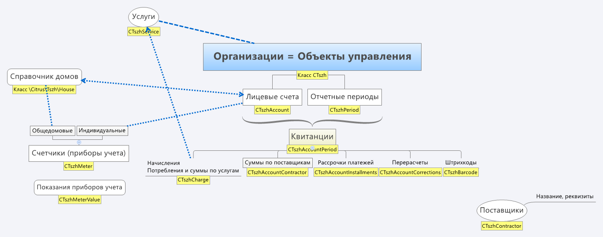

# Содержание

<!-- MarkdownTOC autolink="true" -->

- [Описание API](#%D0%9E%D0%BF%D0%B8%D1%81%D0%B0%D0%BD%D0%B8%D0%B5-api)
    - [Организации \(класс CTszh\)](#%D0%9E%D1%80%D0%B3%D0%B0%D0%BD%D0%B8%D0%B7%D0%B0%D1%86%D0%B8%D0%B8-%D0%BA%D0%BB%D0%B0%D1%81%D1%81-ctszh)
    - [Дома \(класс \Citrus\Tszh\HouseTable\)](#%D0%94%D0%BE%D0%BC%D0%B0-%D0%BA%D0%BB%D0%B0%D1%81%D1%81-citrustszhhousetable)
    - [Период \(класс CTszhPeriod\)](#%D0%9F%D0%B5%D1%80%D0%B8%D0%BE%D0%B4-%D0%BA%D0%BB%D0%B0%D1%81%D1%81-ctszhperiod)
    - [Лицевой счет \(класс CTszhAccount\)](#%D0%9B%D0%B8%D1%86%D0%B5%D0%B2%D0%BE%D0%B9-%D1%81%D1%87%D0%B5%D1%82-%D0%BA%D0%BB%D0%B0%D1%81%D1%81-ctszhaccount)
    - [История изменения полей лицевого счета \(класс CTszhAccountHistory\)](#%D0%98%D1%81%D1%82%D0%BE%D1%80%D0%B8%D1%8F-%D0%B8%D0%B7%D0%BC%D0%B5%D0%BD%D0%B5%D0%BD%D0%B8%D1%8F-%D0%BF%D0%BE%D0%BB%D0%B5%D0%B9-%D0%BB%D0%B8%D1%86%D0%B5%D0%B2%D0%BE%D0%B3%D0%BE-%D1%81%D1%87%D0%B5%D1%82%D0%B0-%D0%BA%D0%BB%D0%B0%D1%81%D1%81-ctszhaccounthistory)
    - [Квитанция \(класс CTszhAccountPeriod\)](#%D0%9A%D0%B2%D0%B8%D1%82%D0%B0%D0%BD%D1%86%D0%B8%D1%8F-%D0%BA%D0%BB%D0%B0%D1%81%D1%81-ctszhaccountperiod)
    - [Счетчик \(класс CTszhMeter\)](#%D0%A1%D1%87%D0%B5%D1%82%D1%87%D0%B8%D0%BA-%D0%BA%D0%BB%D0%B0%D1%81%D1%81-ctszhmeter)
    - [Показание счетчика \(класс CTszhMeterValue\)](#%D0%9F%D0%BE%D0%BA%D0%B0%D0%B7%D0%B0%D0%BD%D0%B8%D0%B5-%D1%81%D1%87%D0%B5%D1%82%D1%87%D0%B8%D0%BA%D0%B0-%D0%BA%D0%BB%D0%B0%D1%81%D1%81-ctszhmetervalue)
    - [Услуги \(класс CTszhService\)](#%D0%A3%D1%81%D0%BB%D1%83%D0%B3%D0%B8-%D0%BA%D0%BB%D0%B0%D1%81%D1%81-ctszhservice)
    - [Начисления \(класс CTszhCharge\)](#%D0%9D%D0%B0%D1%87%D0%B8%D1%81%D0%BB%D0%B5%D0%BD%D0%B8%D1%8F-%D0%BA%D0%BB%D0%B0%D1%81%D1%81-ctszhcharge)
    - [Поставщики \(класс CTszhContractor\)](#%D0%9F%D0%BE%D1%81%D1%82%D0%B0%D0%B2%D1%89%D0%B8%D0%BA%D0%B8-%D0%BA%D0%BB%D0%B0%D1%81%D1%81-ctszhcontractor)
    - [Суммы по поставщикам в квитанции \(класс CTszhAccountContractor\)](#%D0%A1%D1%83%D0%BC%D0%BC%D1%8B-%D0%BF%D0%BE-%D0%BF%D0%BE%D1%81%D1%82%D0%B0%D0%B2%D1%89%D0%B8%D0%BA%D0%B0%D0%BC-%D0%B2-%D0%BA%D0%B2%D0%B8%D1%82%D0%B0%D0%BD%D1%86%D0%B8%D0%B8-%D0%BA%D0%BB%D0%B0%D1%81%D1%81-ctszhaccountcontractor)
    - [Рассрочки платежей \(класс CTszhAccountInstallments\)](#%D0%A0%D0%B0%D1%81%D1%81%D1%80%D0%BE%D1%87%D0%BA%D0%B8-%D0%BF%D0%BB%D0%B0%D1%82%D0%B5%D0%B6%D0%B5%D0%B9-%D0%BA%D0%BB%D0%B0%D1%81%D1%81-ctszhaccountinstallments)
    - [Перерасчеты \(класс CTszhAccountCorrections\)](#%D0%9F%D0%B5%D1%80%D0%B5%D1%80%D0%B0%D1%81%D1%87%D0%B5%D1%82%D1%8B-%D0%BA%D0%BB%D0%B0%D1%81%D1%81-ctszhaccountcorrections)
    - [Штрихкоды \(класс CTszhBarCode\)](#%D0%A8%D1%82%D1%80%D0%B8%D1%85%D0%BA%D0%BE%D0%B4%D1%8B-%D0%BA%D0%BB%D0%B0%D1%81%D1%81-ctszhbarcode)

<!-- /MarkdownTOC -->

# Описание API

Ниже описаны сущности модуля, каждая представлена своим классом с типовыми методами:

* `Add`
* `Update`
* `Delete`
* `GetList`
* `GetByID`

В коде есть комментарии `phpDoc`, можно поглядывать туда.

Обязательные поля выделены **жирным**. Некоторые сущности поддерживают пользовательские поля главного модуля, в списке полей таких сущностей указано поле `UF_*`.

> Колонка **Вирт.** содержит название связанной сущности где хранятся данные или `+` если поле вычисляемое. Такое поле присутсвует только в результатах `GetList`. Для изменения нужно испльзовать методы указанной сущности.

## Организации (класс CTszh)

Они же **Объекты управления**, в админке находятся на странице *Сервисы — ТСЖ — Объекты управления*.

|Название|Значение|Тип|Дополнительно|
|---|---|---|---|
|ID|ID|int||
|**SITE_ID**|ID сайта|string||
|**NAME**|Наименование|string||
|CODE|Символьный код|string||
|TIMESTAMP_X|Дата последнего изменения|datetime||
|ADDRESS|Фактический адрес|string||
|EMAIL|E-mail организации для отображения в контактах|string||
|PHONE|Телефон, факс|string||
|PHONE_DISP|Диспетчерская|string||
|RECEIPT_TEMPLATE|Шаблон квитанций|string||
|RECEIPT_EPD1161_CONTACT_CENTER|Контактный центр для квитанции epd-1161|string||
|INN|ИНН|string||
|KPP|КПП|string||
|RSCH|Расчетный счет|string||
|BANK|Банк|string||
|KSCH|Корреспондентский счет|string||
|BIK|БИК|string||
|HEAD_NAME|ФИО руководителя|string||
|LEGAL_ADDRESS|Юридический адрес|string||
|OFFICE_HOURS|Расписание работы|array|Хранится в БД как сериализованный массив|
|MONETA_ENABLED|Разрешить возможность приёма платежей через «Монету.ру»|char||
|MONETA_OFFER|Принята оферта Монеты.ру|char|Если оферта принята, значит монета подключена по 1-й схеме|
|MONETA_EMAIL|E-mail для взаимодействия с сервисом Монета.ру|string||
| | Период, в котором разрешен ввод показаний счетчиков| |
|METER_VALUES_START_DATE|Начало периода|int|День месяца|
|METER_VALUES_END_DATE|Окончание|int|День месяца|
|UF_*| |mixed|Пользовательские поля главного модуля, объект `TSZH`|

## Дома (класс \Citrus\Tszh\HouseTable)

Справочник домов. Админка: *Сервисы — ТСЖ — Дома*.

|Название|Значение|Вирт.|Тип|Дополнительно|
|---|---|---|---|---|
|ID|ID|int||
|**TSZH_ID**|Объект управления (CTszh)| |int||
|EXTERNAL_ID|Внешний код| |string||
|AREA|Общая площадь| |float||
|ROOMS_AREA|Площадь жилых помещений| |float||
|COMMON_PLACES_AREA|Площадь мест общего пользования| |float||
|REGION|Регион| |string[50]||
|DISTRICT|Район| |string[50]||
|CITY|Город| |string[50]||
|SETTLEMENT|Населенный пункт| |string[50]||
|STREET|Улица| |string[50]||
|HOUSE|Номер дома| |string[50]||
|FULL_ADDRESS|Адрес|+|string||
|ZIP|Почтовый индекс| |string[20]||
|BANK|Банк| |string[100]|Платежные реквизиты используются как основные реквизиты в квитанциях на капитальный ремонт у лицевых счетов этого дома|
|BIK|БИК| |string[16]||
|RS|Расчетный счет| |string[24]||
|KS|Корреспондентский счет| |string[24]||

## Период (класс CTszhPeriod)

*Отчетные периоды* (месяцы), в админке находятся на странице *Сервисы — ТСЖ — Периоды*.

|Название|Значение|Вирт.|Тип|Дополнительно|
|---|---|---|---|---|
|ID|ID|int||
|**TSZH_ID**|ID объекта управления (CTszh)| |int||
|DATE|Дата периода| |string|В формате `YYYY-MM-DD`|
|MONTH|Месяц|+|string|В формате `YYYY-MM`
|TIMESTAMP_X|Дата последнего изменения| |string||
|ACTIVE|Период активен| |char (Y/N)||
|ONLY_DEBT|Без начислений| |char (Y/N)|Если галочка установлена, начисления и квитанция по периоду не будут отображаться жильцам. Используется для предваритальной публикации задолженности, до подготовки квитанций.|

## Лицевой счет (класс CTszhAccount)

**Сервисы — ТСЖ — Лицевые счета**.

|Название|Значение|Вирт.|Тип|Дополнительно|
|---|---|---|---|---|
|TYPE|Тип лицевого счета| |int (1/2) |1 — Физическое лицо, 2 — Юридическое лицо|
|CURRENT|Текущий?| |char (Y/N)|У пользователей может быть несколько лицевых счетов. Выбранный в данный момент имеет этот признкак|
|USER_ID|ID пользователя (CUser)| |int||
|**TSZH_ID**|ID объекта управления (CTszh)| |int||
|XML_ID|Номер лицевого счета| |string||
|EXTERNAL_ID|Внешний код (из 1С)| |string||
|NAME|ФИО владельца| |string||
|HOUSE_ID|ID дома (\Citrus\Tszh\House)| |int||
|FLAT|Номер квартиры| |string||
|FLAT_ABBR|Номер помещения с обозначением типа| |string|Например, `кв. 1` или `оф. 1`|
|FLAT_TYPE|Тип квартиры| |string|Указывает квартира|
|AREA|Общая площадь| |double||
|LIVING_AREA|Жилая площадь| |double||
|PEOPLE|Количество проживающих людей| |int||
|REGISTERED_PEOPLE|Количество зарегистрированных людей| |int||
|EXEMPT_PEOPLE|Количество льготников| |int||
|CITY|Город|Дом|string||
|DISTRICT|Район|Дом|string||
|REGION|Регион|Дом|string||
|SETTLEMENT|Населенный пункт|Дом|string||
|STREET|Улица|Дом|string||
|HOUSE|Номер дома|Дом|string||
|ZIP|Почтовый индекс|Дом|string||
|HOUSE_BANK|Банк|Дом|string||
|HOUSE_BIK|БИК|Дом|string||
|HOUSE_RS|Расчетный счет|Дом|string||
|HOUSE_KS|Корреспондентский счет|Дом|string||
|HOUSE_AREA|Общая площадь|Дом|string||
|HOUSE_ROOMS_AREA|Площадь жилых помещений|Дом|string||
|HOUSE_COMMON_PLACES_AREA|Площадь мест общего пользования|Дом|string||
|ADDRESS_FULL|Полный адрес одной строкой|Дом|string||
|USER_ACTIVE|активность|Пользователь|char||
|USER_LOGIN|Логин|Пользователь|string||
|USER_XML_ID|Внешний код|Пользователь|string||
|USER_NAME|Имя|Пользователь|string||
|USER_LAST_NAME|Фамилия|Пользователь|string||
|USER_SECOND_NAME|Отчество|Пользователь|string||
|USER_FULL_NAME|ФИО|Пользователь|string||
|USER_EMAIL|E-mail|Пользователь|string||
|USER_SITE|ID сайта|Пользователь|string||
|TSZH_NAME|Наименование|Пользователь|string||
|TSZH_SITE|ID сайта|Пользователь|string||
|TSZH_CODE|Символьный код|Пользователь|string||
|TSZH_METER_VALUES_START_DATE|День начала приёма показаний счетчиков|Объект управления|int||
|TSZH_METER_VALUES_END_DATE|День окончания приёма показаний счетчиков|Объект управления|int||
|HAS_METERS|Признак наличия у лицевого счета приборов учета (счетчиков)|+|char (Y/N)||
|UF_*| |mixed| |Пользовательские поля главного модуля, объект `TSZH_ACCOUNT`|

## История изменения полей лицевого счета (класс CTszhAccountHistory)

Изменения полей лицевого счета сохраняются для того, чтобы выводить в квитанции актуальные на дату формирования квитанции данные лицевого счета. Подстановка актуальных данных производится автоматически в компоненте квитанции.

Историю изменения можно посомотреть на странице редактирования лицевого счета (Сервисы — ТСЖ — Лицевые счета), вкладка **История**.

|Название|Значение|Вирт.|Тип|Дополнительно|
|---|---|---|---|---|
|ID|ID| |int||
|**ACCOUNT_ID**|Лицевой счет (CTszhAccount)| |int||
|**TIMESTAMP_X**|Дата изменений| |datetime||
|**FIELDS**|Предыдущие значения полей| |array|Хранится в БД в сериализованном виде|

## Квитанция (класс CTszhAccountPeriod)

**Сервисы — ТСЖ — Квитанции**.

|Название|Значение|Вирт.|Тип|Дополнительно|
|---|---|---|---|---|
|**ACCOUNT_ID**||Лицевой счет|int||
|**PERIOD_ID**|ID периода (CTszhPeriod)| |int||
|TYPE|Тип квитанции| |int|| см. \Citrus\Tszh\Types\ReceiptType
|TIMESTAMP_X|Дата последнего изменения| |datetime||
|BARCODE|Штрихкод| |string|| **Устарело**. Используйте `\CTszhBarCode`
|DEBT_BEG|Задолженность на начало периода| |float||
|DEBT_END|Задолженность на конец периода| |float||
|DEBT_PREV|Задолженность за предыдущие периоды| |float||
|PREPAYMENT|Аванс на начало периода| |float||
|CREDIT_PAYED|Предоплата рассрочки| |float||
|SUMM_TO_PAY|Итого к оплате| |float||
|LAST_PAYMENT|Дата последнего платежа| |date||
|DATE_SENT|Дата отправки письма с квитанцией| |datetime||
|IS_SENT|Письмо с квитанцией отправлено| |char Y/N||
|PERIOD_DATE||Период|string||
|PERIOD_TSZH_ID||Период|int||
|PERIOD_ACTIVE||Период|char||
|PERIOD_ONLY_DEBT||Период|char||
|ACCOUNT_NAME||Лицевой счет|string||
|USER_ID||Лицевой счет|int||
|XML_ID||Лицевой счет|string||
|EXTERNAL_ID||Лицевой счет|string||
|TSZH_RECEIPT_TEMPLATE||Объект управления|string||
|FLAT||Лицевой счет|string||
|FLAT_ABBR||Лицевой счет|string||
|FLAT_INT||Лицевой счет|int||
|FLAT_TYPE||Лицевой счет|string||
|AREA||Лицевой счет|double||
|LIVING_AREA||Лицевой счет|double||
|PEOPLE||Лицевой счет|int||
|REGISTERED_PEOPLE||Лицевой счет|int||
|EXEMPT_PEOPLE||Лицевой счет|int||
|CITY||Дом|string||
|DISTRICT||Дом|string||
|REGION||Дом|string||
|SETTLEMENT||Дом|string||
|STREET||Дом|string||
|HOUSE||Дом|string||
|ZIP||Дом|string||
|HOUSE_BANK||Дом|string||
|HOUSE_BIK||Дом|string||
|HOUSE_RS||Дом|string||
|HOUSE_KS||Дом|string||
|HOUSE_AREA||Дом|string||
|HOUSE_ROOMS_AREA||Дом|string||
|HOUSE_COMMON_PLACES_AREA||Дом|string||
|ADDRESS_FULL||Дом|string||
|USER_LOGIN||Дом|string||
|USER_NAME||Дом|string||
|USER_LAST_NAME||Дом|string||
|USER_SECOND_NAME||Дом|string||
|USER_FULL_NAME||Дом|string||
|USER_EMAIL||Дом|string||
|USER_SITE||Дом/string||
|BARCODES||Дом|string||
|BARCODES_TYPE||Дом|string||
|UF_*| |mixed| |Пользовательские поля главного модуля, объект `TSZH_ACCOUNT_PERIOD`|

## Счетчик (класс CTszhMeter)

**Сервисы — ТСЖ — Счетчики**.

* Подразделяются на **индивидуальные** (установленные у собственников) и **общедомовые**.
* Связаны с **лицевыми счетами**, у которых установлены (связь многие-ко-многим)

|Название|Значение|Вирт.|Тип|Дополнительно|
|---|---|---|---|---|
|ID|ID| |int||
|ACTIVE|Активность| |char||
|HOUSE_METER|Общедомой счетчик| |char (Y/N)||
|XML_ID|Внешний код| |string||
|NAME|Наименование| |string||
|NUM|Заводской номер| |string||
|SERVICE_ID|Услуга| |int|Привязка к услуге (CTszhService). В штатной загрузке из 1С это поле на заполняется|
|SERVICE_NAME|Наименование услуги| |string||
|VALUES_COUNT|Количество тарифов| |int (1—3)|Для многотарифных счетчиков. Они имеют несколько показаний|
|DEC_PLACES|Количество знаков после запятой| |int||
|CAPACITY|Количество разрядов счетчика| |int||
|SORT|Сортировка| |int||
|VERIFICATION_DATE|Дата поверки| |date||
|ACCOUNT_ID|Лицевые счета счетчика|+|int[]|Массив ID лицевых счетов. Для изменения методы `CTszhMeter::bindAccount()`` и `CTszhMeter::unBinkAccount()`|
|TSZH_ID|Объекты управления|+|int[]|Массив|
|USER_ID|Пользователи|+|int[]|Массив|
|ACCOUNT_XML_ID|Номера л/с|Лицевой счет|string|Массив|
|ACCOUNT_EXTERNAL_ID|Внешние коды л/с|Лицевой счет|string[]|Массив|
|ACCOUNT_NAME|ФИО владельцев л/с|Лицевой счет|string[]|Массив|
|ACCOUNT_FLAT|Квартиры л/с|Лицевой счет|string[]|Массив|
|ACCOUNT_AREA|Общие площади л/с|Лицевой счет|double[]|Массив|
|ACCOUNT_LIVING_AREA|Жилые площади л/с|Лицевой счет|double[]|Массив|
|ACCOUNT_PEOPLE|Кол-во человек л/с|Лицевой счет|int[]|Массив|
|UF_*| |mixed| |Пользовательские поля главного модуля, объект `TSZH_METER`|

## Показание счетчика (класс CTszhMeterValue)

**Сервисы — ТСЖ — Счетчики — История**.

|Название|Значение|Вирт.|Тип|Дополнительно|
|---|---|---|---|---|
|ID|ID| |int||
|**METER_ID**|ID счетчика (CTszhMeter)| |int||
|VALUE1|Показание по тарифу 1| |double||
|VALUE2|Показание по тарифу 2| |double||
|VALUE3|Показание по тарифу 3| |double||
|AMOUNT1|Расход по тарифу 1| |double||
|AMOUNT2|Расход по тарифу 2| |double||
|AMOUNT3|Расход по тарифу 3| |double||
|TIMESTAMP_X|Дата ввода (показаний)| |datetime||
|MODIFIED_BY|Кем введено| |int|ID пользователя (CUser), заполнившего показания|
|MODIFIED_BY_OWNER|Введено владельцем?|+|char (Y/N)|Признак того, что показания введены владельцем **на сайте**, `N` если получены из 1С|
|MONTH|Месяц показаний|+|string|В формате `YYYY-MM`|
|METER_ACTIVE|Активность|Счетчик|char (Y/N)||
|METER_HOUSE_METER||Счетчик|char (Y/N)||
|XML_ID|Внешний код|Счетчик|string||
|NAME|Наименование|Счетчик|string||
|NUM|Заводсткой номер|Счетчик|string||
|SERVICE_ID|Услуга|Счетчик|int||
|SERVICE_NAME|Наименование услуги|Счетчик|string||
|VALUES_COUNT|Количество тарифов|Счетчик|int (1—3)|Для многотарифных счетчиков. Они имеют несколько показаний|
|DEC_PLACES|Количество знаков после запятой|Счетчик|int||
|CAPACITY|Количество разрядов|Счетчик|int||
|SORT|Сортировка|Счетчик|int||
|VERIFICATION_DATE|Дата поверки|Счетчик|date||
|ACCOUNT_ID|Лицевые счета счетчика|Счетчик|int[]|Массив ID лицевых счетов|
|TSZH_ID|Объекты управления|Счетчик|int[]|Массив|
|USER_ID|Пользователи|Счетчик|int[]|Массив|
|ACCOUNT_XML_ID|Номера л/с|Лицевой счет|string|Массив|
|ACCOUNT_EXTERNAL_ID|Внешние коды л/с|Лицевой счет|string[]|Массив|
|ACCOUNT_NAME|ФИО владельцев л/с|Лицевой счет|string[]|Массив|
|ACCOUNT_FLAT|Квартиры л/с|Лицевой счет|string[]|Массив|
|ACCOUNT_AREA|Общие площади л/с|Лицевой счет|double[]|Массив|
|ACCOUNT_LIVING_AREA|Жилые площади л/с|Лицевой счет|double[]|Массив|
|ACCOUNT_PEOPLE|Кол-во человек л/с|Лицевой счет|int[]|Массив|
|UF_*| |mixed| |Пользовательские поля главного модуля, объект `TSZH_METER_VALUE`|

## Услуги (класс CTszhService)

**Сервисы — ТСЖ — Услуги**.

Строки начислений в квитанции используют справочник **Услуги**. По историческим причинам под каждый тариф услуги создается отдельная запись справочника услуг, таким образом может быть множество записей с одинаковым наименованием, но разным набором полей услуги.

|Название|Значение|Вирт.|Тип|Дополнительно|
|---|---|---|---|---|
|ID|ID| |int||
|ACTIVE|Активность| |char||
|**TSZH_ID**|Объект управления| |int||
|XML_ID|Символьный код| |string|По смыслу это *внешний код* услуги. Поскольку в формате обемен с 1С у услуг нет такого поле, заполняется *хешем* на основе других полей услуги.|
|**NAME**|Наименование| |string||
|NORM|Норма потребления| |double||
|TARIFF|Тариф| |double|Устарело в версии 4 формата обмена с 1С|
|TARIFF2|Тариф 2| |double|Для многотарифных услуг (см. VALUE_COUNT у счетчиков). Устарело в версии 4 формата обмена с 1С|
|TARIFF3|Тариф 3| |double|Для многотарифных услуг. Устарело в версии 4 формата обмена с 1С|
|UNITS|Единицы измерения| |string||
|UF_*| |mixed| |Пользовательские поля главного модуля, объект `TSZH_SERVICE`|

## Начисления (класс CTszhCharge)
Вкладка **Начисленные услуги** на странице квитанции (*Сервисы — ТСЖ — Квитанции*).

|Название|Значение|Вирт.|Тип|Дополнительно|
|---|---|---|---|---|
|ID|ID| |int||
|COMPONENT|Признак детализации| |char (Y/N/Z)|Если содержит `Y` или `Z` — запись является строкой, расписывающей составные части предыдущего начисления (*«детализацией»*).<ul><li>для <code>COMPONENT=Z</code> вообще не выводим показания счетчиков. Для основной строки таких начислений выводим через слеш суммы дневных, ночных и пиковых показаний всех счетчиков этой основной строки</li><li>для <code>СOMPONENT=Y</code> выводим суммы показаний счетчиков дневного, ночного и пикового показаний для всех счетчиков. В основной строке ничего не выводим</li></ul>|
|GROUP|Группа начислений| |string|Номер или наименование группы. 1 - коммунальные услуги, 2 — жилищные услуги, 3 — прочие услуги.|
|SERVICE_ID|Услуга (`CTszhService`)| |int||
|**ACCOUNT_PERIOD_ID**|Квитанция (`CTszhAccountPeriod`)| |int||
|DEBT_ONLY|Долг| |char (Y/N)||Признак того, что по этой услуги не было начислений за указанный месяц, суммы включают в себя неоплаченную задолженность за предыдущие периоды. Такие строки не выводятся в квитанциях.
|AMOUNT|Объем коммунальных услуг| |double|включает в себя индивидуальный и общедомовой объемы|
|AMOUNTN|Способ подсчета объёма коммунальных услуг| |int|Расшивровка есть в квитанции по 354 постановлению (`post-354`)|
|AMOUNT_NORM|Норма потребления| |double|индивидуальная + общедомовая|
|RATE|Тариф| |string|Добавлено в версии 4 формата обмена с 1С. До этого использовались поля TARIF* в справочнике услуг|
|SUMM|Начислено| |double|Сумма начисления (индивидуальная + общедомовая)|
|CORRECTION|Сумма перерасчета по услуге| |double||
|COMPENSATION|Сумма льгот по услуге| |double||
|SUMM_PAYED|Оплачено за услугу| |double|Сумма оплаты в предыдущем месяце|
|SUMM2PAY|Сумма к оплате| |double|Индивидуальная + общедомовая|
|SORT|Порядок вывода| |int||
|HAMOUNT|Объем коммунальных услуг (общедомовой)| |double||
|HAMOUNTN|Способ подсчета объёма (общедомовой)| |int||
|HSUMM|Начислено (общедомовое)| |double||
|HSUMM2PAY|Сумма к оплате (общедомовая)| |double||
|HNORM|Норма потребления (общедомовая)| |double||
|VOLUMEP|Суммарный объем коммунальных услуг в помещениях дома| |double|Используется в шаблоне квитанции `post-354`|
|VOLUMEH|Суммарный объем коммунальных услуг на общедомовые нужды| |double|Используется в шаблоне квитанции `post-354`|
|VOLUMEA|Суммарный объем учетного объема потребления| |double|Используется в шаблоне квитанции `post-354`|
|PENALTIES|Сумма пени по услуге| |double||
|DEBT_BEG|Задолженность на начало периода по услуге| |double||
|DEBT_END|Задолженность на конец периода по услуге| |double||
|X_FIELDS|Поля, содержащие `X`| |string|Некоторые поля в квитанции заполняются значением `X`|
|ACCOUNT_ID|Лицевой счет (CTszhAccount)|Квитанция|int||
|PERIOD_ID|Период (CTszh)|Квитанция|int||
|PERIOD_TYPE|Тип квитанции|Квитанция|int||
|SERVICE_ACTIVE||Услуга|char||
|SERVICE_XML_ID||Услуга|string||
|SERVICE_TSZH_ID||Услуга|int||
|SERVICE_NAME|Наименование|Услуга|string||
|SERVICE_NORM|Норма потребления|Услуга|double||
|SERVICE_TARIFF|Тариф|Услуга|double|Устарело с версии 4 формата обмена с 1С. Используйте `RATE`|
|SERVICE_TARIFF2|Тариф 2|Услуга|double|Устарело с версии 4 формата обмена с 1С. Используйте `RATE`|
|SERVICE_TARIFF3|Тариф 3|Услуга|double|Устарело с версии 4 формата обмена с 1С. Используйте `RATE`|
|SERVICE_UNITS|Ед. измерения|Услуга|string||
|USER_ID|Пользователь (CUser)|Лицевой счет|int||
|PERIOD_TSZH_ID|Объект управления (CTszh)|Период|int||
|PERIOD_DATE|Отчетный месяц|Период|string|В формате `YYYY-MM-DD`|
|PERIOD_ACTIVE|Активность периода|Период|char (Y/N)||
|PERIOD_ONLY_DEBT|Без начислений|Период|char (Y/N)||
|HMETER_ID|*хз, уже не помню*|+|int||
|HMETER_IDS|Общедомовые приборы учета|+|int[]|Возвращает массив с ID счетчиков, относящихся к услуге начисления. Для установки используется метод `CTszhCharge::bindMeter()` и `unbindMeter`|
|METER_IDS|Индивидуальные приборы учета|+|int[]|Возвращает массив с ID счетчиков, относящихся к услуге начисления. Для установки используется метод `CTszhCharge::bindMeter()` и `unbindMeter`|
|UF_*| |mixed| |Пользовательские поля главного модуля, объект `TSZH_CHARGE`|

## Поставщики (класс CTszhContractor)

Ревизиты поставщиков для вывода в квитанциях. Админка: **Сервисы — ТСЖ — Поставщики**.

|Название|Значение|Вирт.|Тип|Дополнительно|
|---|---|---|---|---|
|ID|ID| |int||
|XML_ID|Внешний код| |string||
|**TSZH_ID**|Объект управления (CTszh)| |int||
|**EXECUTOR**|Является исполнителем?| |char (Y/N/Z)|Исполнитель выводится в *Разделе 1* квитанции `post-354`, остальные — в *Разделе 2*|
|**NAME**|Наименование| |string||
|SERVICES|Услуги| |string||
|ADDRESS|Адрес| |string||
|PHONE|Телефон| |string||
|BILLING|Платежные реквизиты в свободной форме| |string|**Устарело**. Сейчас используются отдельные поля для реквизитов (см. ниже)|
|INN|ИНН| |string||
|KPP|КПП| |string||
|RSCH|Расчетный счет| |string||
|BANK|Банк| |string||
|KSCH|Корреспондентский счет| |string||
|BIK|БИК| |string||
|UF_*| |mixed|Пользовательские поля главного модуля, объект `TSZH_CONTRACTOR`|

## Суммы по поставщикам в квитанции (класс CTszhAccountContractor)

Содержит сведения о поставщиках услуг, выводимые в *разделе 2* шаблона квитанции `post-354`. В админке отображается на форме редактирования квитанции (Сервисы — ТСЖ — Квитанции), раздел **Поставщики услуг**.

|Название|Значение|Вирт.|Тип|Дополнительно|
|---|---|---|---|---|
|ID|ID| |int||
|**ACCOUNT_PERIOD_ID**|Квитанция (CTszhAccountPeriod)| |int||
|**CONTRACTOR_ID**|Поставщик (CTszhContractor)| |int||
|DEBT_BEG|Задолженность на начало периода| |float||
|SUMM_PAYED|Оплачено за период| |float||
|PENALTIES|Штрафы, пени, руб.| |float||
|SUMM_CHARGED|Начислено за период, руб.| |float||
|SUMM|Итого к оплате, руб.| |float||
|RECEIPT_ORDER|Порядок вывода в квитанции| |int||
|SERVICES|Услуги| |string|Если поле заполенно, должно использоваться вместо `CONTRACTOR_SERVICES`|
|CONTRACTOR_XML_ID|Внешний код|Поставщик|string||
|CONTRACTOR_TSZH_ID|Объект управления (CTszh)|Поставщик|int||
|CONTRACTOR_EXECUTOR|Является исполнителем?|Поставщик|char (Y/N)||
|CONTRACTOR_NAME|Наименование|Поставщик|string||
|CONTRACTOR_SERVICES|Услуги|Поставщик|string||
|CONTRACTOR_ADDRESS|Адрес|Поставщик|string||
|CONTRACTOR_PHONE|Телефон|Поставщик|string||
|CONTRACTOR_BILLING|Платежные реквизиты в свободной форме|Поставщик|string|**Устарело**. Сейчас используются отдельные поля для реквизитов (см. ниже)|
|CONTRACTOR_INN|ИНН|Поставщик|string||
|CONTRACTOR_KPP|КПП|Поставщик|string||
|CONTRACTOR_RSCH|Расчетный счет|Поставщик|string||
|CONTRACTOR_BANK|Банк|Поставщик|string||
|CONTRACTOR_KSCH|Корреспондентский счет|Поставщик|string||
|CONTRACTOR_BIK|БИК|Поставщик|string||

## Рассрочки платежей (класс CTszhAccountInstallments)

Рассрочки платежей используются в квитанции `epd-1161`.

|Название|Значение|Вирт.|Тип|Дополнительно|
|---|---|---|---|---|
|ID|ID| |int||
|**ACCOUNT_PERIOD_ID**|Квитанция (CTszhAccountPeriod)| |int||
|CONTRACTOR_ID|Поставщик (CTszhContrator)| |int||
|**SERVICE**|Виды услуг| |string||
|**SUMM_PAYED**|Оплата за расч. период| |float||
|**SUMM_PREV_PAYED**|Оплата за пред. период| |float||
|**PERCENT**|Проценты за рассрочку (%)| |float||
|**SUMM_RATED**|Проценты за рассрочку (руб)| |float||
|**SUMM2PAY**|Итого| |float||
|CONTRACTOR_XML_ID|Внешний код|Поставщик|string||
|CONTRACTOR_TSZH_ID|Объект управления (CTszh)|Поставщик|int||
|CONTRACTOR_EXECUTOR|Является исполнителем?|Поставщик|char (Y/N)||
|CONTRACTOR_NAME|Наименование|Поставщик|string||
|CONTRACTOR_SERVICES|Услуги|Поставщик|string||
|CONTRACTOR_ADDRESS|Адрес|Поставщик|string||
|CONTRACTOR_PHONE|Телефон|Поставщик|string||
|CONTRACTOR_BILLING|Платежные реквизиты в свободной форме|Поставщик|string|**Устарело**. Сейчас используются отдельные поля для реквизитов|

## Перерасчеты (класс CTszhAccountCorrections)

Сведения о перерасчетах выводятся в квитанциях `post-354` и `epd-1161`.

|Название|Значение|Вирт.|Тип|Дополнительно|
|---|---|---|---|---|
|ID|ID| |int||
|XML_ID|Внешний код| |string||
|**ACCOUNT_ID**|Лицевой счет (CTszhAccount)| |int||
|**ACCOUNT_PERIOD_ID**|Квитанция (CTszhAccountPeriod)| |int||
|CONTRACTOR_ID|Поставщик (CTszhContractor)| |int||
|GROUNDS|Основание перерасчета| |string||
|SERVICE|Виды услуг| |string||
|SUMM|Сумма, руб.| |float||
|CONTRACTOR_XML_ID|Внешний код|Поставщик|string||
|CONTRACTOR_TSZH_ID|Объект управления (CTszh)|Поставщик|int||
|CONTRACTOR_EXECUTOR|Является исполнителем?|Поставщик|char (Y/N)||
|CONTRACTOR_NAME|Наименование|Поставщик|string||
|CONTRACTOR_SERVICES|Услуги|Поставщик|string||
|CONTRACTOR_ADDRESS|Адрес|Поставщик|string||
|CONTRACTOR_PHONE|Телефон|Поставщик|string||
|CONTRACTOR_BILLING|Платежные реквизиты в свободной форме|Поставщик|string|**Устарело**. Сейчас используются отдельные поля для реквизитов|

## Штрихкоды (класс CTszhBarCode)

Справочник штриходов квитанции, в админке выводятся на форме редактирования квитанции.

|Название|Значение|Вирт.|Тип|Дополнительно|
|---|---|---|---|---|
|ID|ID| |int||
|**ACCOUNT_PERIOD_ID**|Квитанция (CTszhAccountPeriod)| |int||
|**TYPE**|Тип| |string|`code128` или `qr`|
|VALUE|Содержимое штрихкода| |string||
